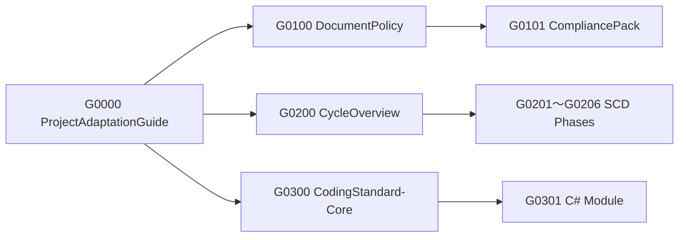

# [ADPT] Project Adaptation Guide

## 1. 目的と位置づけ
本書は、汎用開発標準群（standards/）全体の **適用・導入・参照ルール** を統合的に定義する。  
各プロジェクトは本書を起点として、文書ポリシー・SCDモデル・コーディング標準の関係を理解し、  
その上で `project-template/` に基づく実装を行う。

> **本書は全標準文書の上位に位置するメタ標準であり、必ず関連付ける（MUST）。**

---

## 2. 適用範囲
- 本書は **standards/** 配下のすべての層（`0-adpt/`, `1-doc/`, `2-scd/`, `3-cod/`）に適用する。  
- 各プロジェクトの `project-template/` は、本書の規定に従って標準文書を参照・継承する。  
- 本書は **G0000-STD-ADPT** として、Document Policy (§3.2) における「メタ標準」に分類される。

---

## 3. 構成と階層
```plaintext
standards/
├── 0-adpt/  ← 本書：適用・導入ガイド層
├── 1-doc/   ← 文書方針・準拠規約
├── 2-scd/   ← 開発プロセスモデル（Spec→Feedback）
├── 3-cod/   ← コーディング規範（Core＋言語モジュール）
```

---

## 4. プロジェクトへの適用手順
1️⃣ **standards/ の取り込み**
- Submodule / ZIP / Package のいずれかで参照する。  
- バージョンはタグ固定（例：`v3.0.0`）。  

2️⃣ **project-template/ のコピー**
- config / compliance / docs / ci / src / tests を複製して新PJを構築。  

3️⃣ **設定ファイルの編集**
- `config/project-config.yml` にプロジェクト識別子と参照標準を記述。  
- `project-coding-overrides.yml` に差異を定義（必要時）。  

4️⃣ **CI導入**
- `ci/workflows/core-check.yml` により、DCMM準拠・PII禁止・命名規則を検証。  
- `csharp-check.yml` で C# 構築とテスト。  
- `conformance.yml` で T2/T4 結果を集約。  

5️⃣ **差異管理**
- Core/LANG差異は `project-coding-overrides.yml` で定義し、ADRに根拠を記録。  
- 差異は有効期限を設け、FeedbackPhase（G0206）で再評価。

---

## 5. 関連構造（Mermaid）


---

## 6. バージョン互換ポリシー
| 区分 | 内容 |
|------|------|
| **MAJOR** | 階層・命名・適用原則に変更が生じた場合。 |
| **MINOR** | 手順・適用例・CI参照更新などの追加。 |
| **PATCH** | 文言修正・誤記訂正など軽微変更。 |

---

## 7. 運用上の注意
- 本書は各標準文書より上位のメタ文書であるため、削除・改変は禁止（MUST）。  
- 変更は標準委員会のレビューを経て新バージョンとして発行。  
- 各PJ文書（P02xx系）は `related_docs` に本書IDを必ず含めること。  

---

## 8. 改訂履歴
| 版 | 日付 | 内容 |
|----|------|------|
| 1.0.0 | 2025-10-26 | G0102 から G0000 に改番。階層統合しメタ標準として再構築。 |
