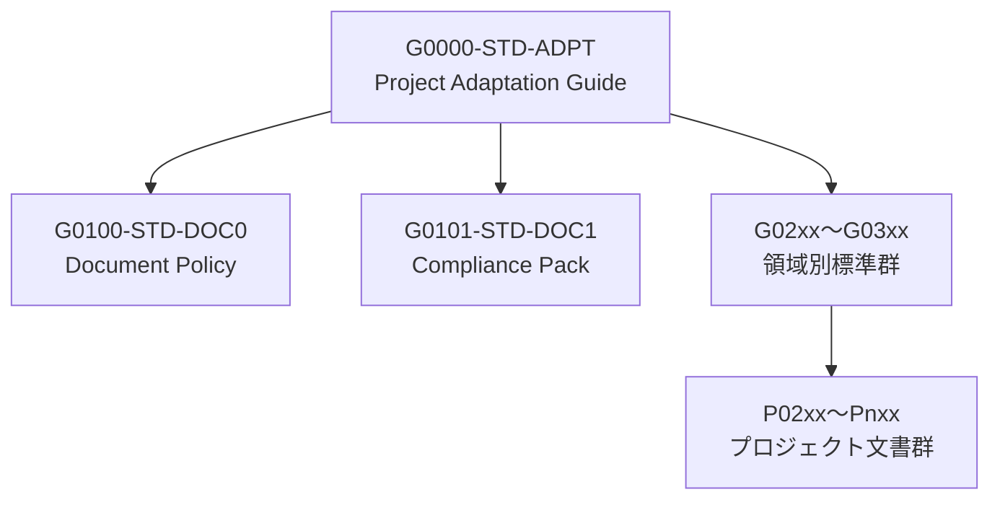

# [STD-ADPT] Project Adaptation Guide
（全標準群およびプロジェクト適用ガイドライン）

---

## 1. 目的と位置づけ

本書は、文書標準体系（G0100 Document Policy）および準拠検証基盤（G0101 Compliance Pack）を、
すべての Generic 標準層（G02xx〜G03xx）および各プロジェクト文書（P系）へ適用するための
包括的なガイドラインを定義する。

本書の改訂 (v3.0.0) では、旧 G0102-STD-DOC2（Project Adaptation Guide）の内容を吸収・統合し、
「プロジェクト適用手順」「設定例」「CI適用ガイド」を包含した。

---

## 2. 適用範囲

| 層 | 対象 | 説明 |
|----|------|------|
| G01 | ポリシー／検証層 | G0100, G0101 |
| G02 | プロセス／開発層 | G0200, G0210, G0220 |
| G03 | 運用／コーディング層 | G0300, G0310, G0320 |
| P系 | プロジェクト文書群 | 各PJ固有の仕様書・設計書群 |

すべての Generic / Project 文書は、本書で定義する「適用原則」に基づき、
G0100 と G0101 の標準を継承しなければならない。

---

## 3. 階層構造と適用関係



---

## 4. プロジェクト適用要領（G0102統合）

### 4.1 適用対象

本章は、プロジェクトにおける標準文書（P系）が G01〜G03層の標準を
どのように参照・適用・派生すべきかを定義する。

| 適用区分 | 内容 | 例 |
|-----------|------|----|
| **直接継承** | G0100 / G0101 の方針をそのまま採用 | ドキュメント構造、命名規則、Front Matter構成 |
| **設定反映** | G02xx / G03xx で定義されたテンプレートをプロジェクト設定に落とし込む | CI設定、テスト仕様、命名パターン |
| **ローカル拡張** | プロジェクト特有の実装や追加ガイドを定義 | ExampleProject の運用標準、社内CIジョブ構成 |

---

### 4.2 プロジェクト固有設定一覧（一般化版）

| 項目 | 説明 | 設定例（ExampleProject） |
|------|------|----------------------|
| 文書格納ルート | PJ標準文書の配置パス | `/projects/example/docs/` |
| 共通スキーマ参照 | DCMMスキーマ定義のパス | `/schemas/dcmm.schema.json` |
| 検証ルール | 準拠ルールセットJSON | `/rules/G0101-STD-DOC1_ruleset.json` |
| 自動修正スコープ | A区分ルール | `["A"]` |
| 機密区分 | 内部限定（Confidential）または内部公開（Internal） | `"Internal"` |
| 承認権限 | PJ管理チーム | `"Project Maintainer"` |
| 構成管理 | git + CI/CD連携 | GitHub Actions, Jenkins 等 |

---

### 4.3 適用フェーズと責務

| フェーズ | 主体 | 主な作業 | 出力成果物 |
|-----------|------|-----------|--------------|
| **準備** | 標準管理者 | テンプレートの提供・ルール配布 | G0101 ルール適用済テンプレート |
| **文書作成** | 各PJチーム | P系標準文書の作成 | P02xx-STD-* |
| **検証** | codex-AI / CI | G0101 ルール実行、自動修正 | 準拠レポート |
| **承認** | PJ責任者 | ドキュメント承認・登録 | 承認済文書 (Approved) |
| **運用** | 運用チーム | 定期レビュー・改訂 | 更新履歴 (vX.Y.Z) |

---

### 4.4 適用テンプレート構造例

```bash
/projects/example/
  docs/
    P0200-STD-ARCH-ArchitectureGuide.md
    P0210-REQ-FREQ-FunctionalRequirements.md
  rules/
    G0101-STD-DOC1_ruleset.json
  schemas/
    dcmm.schema.json
  codex-ai-config.yaml
```

---

## 5. 運用ルールと設定例（CI / codex-AI適用）

### 5.1 設定ファイル例（汎用化）

```yaml
# codex-ai-config.yaml
base_policy: "G0100-STD-DOC0"
compliance_pack: "G0101-STD-DOC1"
adaptation_guide: "G0000-STD-ADPT"
ruleset: "/rules/G0101-STD-DOC1_ruleset.json"

auto_fix:
  enable: true
  scope: ["A"]
  restrict_pii: true

validation:
  schema_ref: "/schemas/dcmm.schema.json"
  version_check: true

report:
  output_format: "jsonl"
  output_dir: "./reports"
```

### 5.2 CI 運用例

```yaml
# .github/workflows/doc-compliance.yml
name: Document Compliance
on:
  pull_request:
    paths: ["docs/**","rules/**","schemas/**","codex-ai-config.yaml"]
jobs:
  validate:
    runs-on: ubuntu-latest
    steps:
      - uses: actions/checkout@v4
      - name: Validate Docs
        run: codex-ai validate --config ./codex-ai-config.yaml
      - name: Auto-fix
        run: codex-ai autofix --apply --scope A
      - name: Generate Report
        run: codex-ai report --output ./reports
```

---

## 6. バージョン互換ポリシー

- 各層の文書 (G01〜G03, P系) は、本書で定義する「適用範囲と責務」を満たす限り、
  Minor / Patch バージョンを独立して更新してよい。
- Major バージョン変更時は、本書 (G0000) の更新に合わせて再承認を行う。

---

## 7. 運用上の注意

- G0102 由来の設定項目・手順は、すべて汎用化済み。
- 個別プロジェクト固有設定は、本書 §4.2 の表をベースに独自 YAML として保持。
- codex-AI による自動検証結果は、`reports/` 配下に集約。

---

## 8. 改訂履歴

| 版 | 日付 | 内容 |
|----|------|------|
| v2.0.0 | 2025-10-23 | standards層統合版として再構築。 |
| v3.0.0 | 2025-10-31 | 旧 G0102-STD-DOC2 の内容を統合。Project適用要領と設定例を追加。 |
