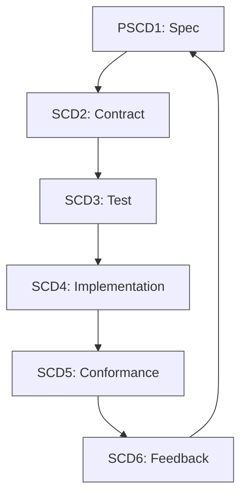
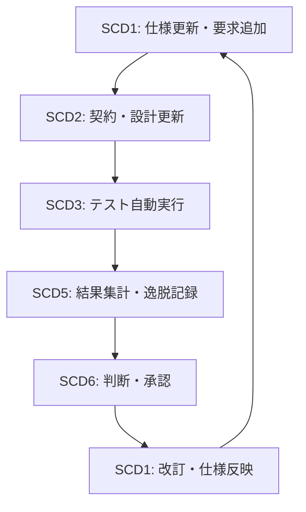

# [SCD-CYCL] 開発サイクル概要（v3.1汎用版・Spec–Conformance Development Cycle）

**Version:** v3.1.0
**Date:** 2025-10-15
**Status:** Draft

---

## 1. 目的と位置づけ / *Purpose and Scope*

本書は、開発活動を「継続的に整合し続ける循環体系」として捉える。  
その中心概念を **Spec–Conformance Development Cycle（SCD）** と定義し、  
仕様（Spec）・契約（Contract）・テスト（Test）・実装（Implementation）・適合確認（Conformance）・フィードバック（Feedback）の各工程が  
常に整合を保ちながら連続して進む枠組みを示す。

**目的：**  
- 開発を止めず、常に整合状態を維持する（Continuous Conformance）。  
- 要求・設計・検証・改善をひとつの循環構造で統合する。  
- 教育・運用・品質保証に再利用可能な共通フレームを提供する。

---

## 2. サイクル構造 / *Spec–Conformance Development Cycle Overview*

```
 ┌───────────────┐
 │ SCD1: 仕様 (Spec) │ ← 要求を形式化（RFC2119）
 └───────┬───────┘
         │
         ▼
 ┌───────────────┐
 │ SCD2: 契約 (Contract) │ ← インタフェース・データ仕様の確定
 └───────┬───────┘
         │
         ▼
 ┌───────────────┐
 │ SCD3: テスト (Test) │ ← 仕様をExampleとして具体化
 └───────┬───────┘
         │
         ▼
 ┌───────────────┐
 │ SCD4: 実装 (Implementation) │ ← Test-Drivenで最小実装を導出
 └───────┬───────┘
         │
         ▼
 ┌───────────────┐
 │ SCD5: 適合確認 (Conformance) │ ← 自動検証と品質統計
 └───────┬───────┘
         │
         ▼
 ┌───────────────┐
 │ SCD6: フィードバック │ ← 結果を仕様・設計へ還流
 └───────────────┘
```

> 各フェーズはトレーサビリティにより結合し、  
> 仕様変更や実装差分を循環の中で即座に吸収する。  

---

## 3. 継続整合ループ / *Continuous Conformance Loop*



> **定義:**  
> “Continuous Conformance” とは、開発プロセスのどの段階でも整合性を検証し、  
> 修正が必要な場合は即座にループへ戻す運用を指す。  
> これは従来の「静的品質管理」から「動的整合管理」への転換を意味する。

---

## 4. フェーズ構成と目的 / *Phases and Objectives*

| フェーズ（コード） | ゴール | 主な手法 | 代表成果物 |
|:--|:--|:--|:--|
| **SCD1 – Spec** | 要求を明確化し形式化 | RFC2119 / 要求分析 | 仕様書、要求一覧 |
| **SCD2 – Contract** | インタフェース・データ仕様を確定 | Contract-First、Schema定義 | データ仕様書、設計契約 |
| **SCD3 – Test** | 仕様をExampleとして具現化 | BDD、シナリオ駆動 | Example仕様、テストケース |
| **SCD4 – Implementation** | テストに基づき最小実装を導出 | TDD、コードレビュー | 実装コード、変更記録 |
| **SCD5 – Conformance** | 実装と仕様の整合を検証 | 自動テスト／統計評価 | Traceability Matrix、検証レポート |
| **SCD6 – Feedback** | 結果を仕様・設計へ反映 | Closed-Loop改善 | 改訂仕様、Decision Record |

> **備考:**  
> 各工程は独立ではなく、SCDサイクル内で相互に整合を確認し続ける。  

---

## 5. テンプレート対応表 / *Template Correlation (T1–T4)*

| テンプレート | 主な用途 | 関連フェーズ |
|:--|:--|:--|
| **T1: ReqID** | 要求定義・承認 | SCD1 |
| **T2: Conformance Matrix** | 整合検証・統計記録 | SCD3〜SCD5 |
| **T3: ADR (Decision Record)** | 判断・設計履歴 | SCD2〜SCD6 |
| **T4: Deviation Record** | 不適合・是正追跡 | SCD5〜SCD6 |

---

## 6. トレーサビリティ構造 / *Traceability Framework*

| 対応軸 | 対象 | 説明 |
|:--|:--|:--|
| 要求 ⇄ テスト | 仕様が具体的に検証可能であることを保証。 |
| テスト ⇄ 実装 | 実装がテストにより裏付けられることを保証。 |
| 実装 ⇄ 検証 | 適合結果をコード変更へ反映。 |
| 検証 ⇄ 仕様 | 改訂が再び仕様書に戻り、循環を完結させる。 |

**成果物例:**  
- Traceability Matrix（要求⇄テスト⇄実装）  
- Architecture Decision Record (ADR)  
- Deviation Log（不適合記録）  

---

## 7. チームの役割とAI支援範囲 / *Roles and AI Responsibility*

| フェーズ | 主担当 | 補助担当 | AI支援（MAY） | 最終判断（MUST） |
|:--|:--|:--|:--|:--|
| **SCD1 – Spec** | 要求分析者 | QA | 曖昧語検出、構文提案 | 人間 |
| **SCD2 – Contract** | 設計者 | 開発者 | Schema整合検証 | 人間 |
| **SCD3 – Test** | QA／テスター | 開発補助 | Example生成、曖昧語修正 | 人間 |
| **SCD4 – Implementation** | 開発者 | 技術リード | コード提案、差分要約 | 人間 |
| **SCD5 – Conformance** | QA／CI管理者 | 品質担当 | 自動検証ログ整形 | 人間 |
| **SCD6 – Feedback** | QA／設計者 | プロジェクト責任者 | 改訂提案、要約 | 人間 |

> **原則:**  
> AI assistance **MAY** be used for validation or generation tasks,  
> but final approval and accountability **MUST** remain with human reviewers.

---

## 8. 教育レベル構造 / *Education and Skill Levels*

| レベル | 対象読者 | 習得目的 | 主な利用資料 |
|:--|:--|:--|:--|
| **L1 – Foundation** | 新規参加者・QA担当 | SCD全体構造と用語を理解 | 本書、入門資料 |
| **L2 – Practitioner** | 開発者・設計者 | 各フェーズの実務運用を実践 | 各フェーズガイド |
| **L3 – Auditor** | 品質保証・PM・教育担当 | プロセス監査と教育支援 | トレーサビリティ資料、チェックリスト |

> **備考:**  
> 本サイクルは教育体系としても利用可能であり、  
> L1→L2→L3の段階的学習を通じてプロセス全体を体得できる。

---

## 9. 運用統合モデル / *Operations and Feedback Integration*



> **概要:**  
> CI/CD などの自動化基盤と連携することで、  
> フィードバックループを止めずに品質を維持する“循環心臓部”として機能する。

---

## 10. フェーズコード参照表 / *Phase Code Reference Table*

| コード | フェーズ名 | 主な目的 |
|:--|:--|:--|
| **SCD1** | Spec Phase | 要求定義と形式化 |
| **SCD2** | Contract Phase | インタフェース・仕様の確定 |
| **SCD3** | Test Phase | Example仕様による検証設計 |
| **SCD4** | Implementation Phase | テスト駆動による実装 |
| **SCD5** | Conformance Phase | 適合性の自動検証 |
| **SCD6** | Feedback Phase | 結果の反映と再整合 |

---

## 11. 要約 / *Summary*

Spec–Conformance Development Cycle（SCD）は、  
**「計画 → 実装 → 検証 → 改善 → 再整合」** の全過程を一体化した自己整合型開発モデルである。  

本モデルは、  
- あらゆる開発ドメインに適用できる汎用的プロセス、  
- 自動化と人間判断の責任分担を両立する設計、  
- 教育・品質・継続改善を同一循環で扱う構造、  
を特徴とする。

> 📘 **本書は、特定プロジェクトに依存しない汎用的なSCD標準フレームとして参照可能である。**

---

## 12. 改訂履歴 / *Revision History*

| Version | Date | Description |
|:--|:--|:--|
| v3.1.0 | 2025-10-15 | YAMLメタデータと構成をG0100/G0101準拠に整備。 |

---

**End of Document**
