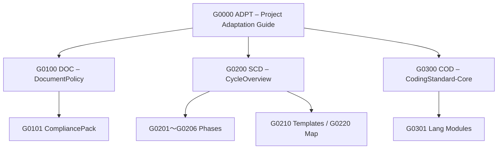

# 📘 標準文書体系 — *DocFoundry Standards Overview (v2.0.0)*

**対象範囲:** `0-standards/`  
**構成単位:** 「0-adpt」「1-doc」「2-scd」「3-cod」  
（現行有効な標準文書のみを対象）

---

## 🧭 1. 目的 / *Purpose*
本ディレクトリは、すべてのDocFoundry準拠プロジェクトに共通して適用される  
**開発標準・文書標準・コーディング標準の中核体系** を定義します。  

ここに収録される標準群は、プロジェクト雛型（`1-project-template/`）の  
全構成を統制する「基盤リファレンス」として機能します。  

---

## 🧱 2. 構成層別の概要

| 階層 | ディレクトリ | 説明 |
|------|---------------|------|
| **0-adpt/** | [G0000-STD-ADPT-ProjectAdaptationGuide](0-adpt/G0000-STD-ADPT-ProjectAdaptationGuide.md) | 全標準群に共通する「メタ標準」。適用・導入・参照ルールを統一定義。 |
| **1-doc/** | [G0100-STD-DOC0-DocumentPolicy](1-doc/G0100-STD-DOC0-DocumentPolicy.md)<br>[G0101-STD-DOC1-CompliancePack](1-doc/G0101-STD-DOC1-CompliancePack.md) | 文書命名・番号体系・改訂規約および準拠確認プロセスを定義。 |
| **2-scd/** | [G0200-STD-SCD0-CycleOverview](2-scd/G0200-STD-SCD0-CycleOverview.md)<br>[G0201〜G0206 各Phase定義](2-scd/)<br>[G0210-STD-SCDT-Templates](2-scd/G0210-STD-SCDT-Templates.md)<br>[G0220-STD-SCDM-PhaseActionMap](2-scd/G0220-STD-SCDM-PhaseActionMap.md) | SCD（Spec–Conformance Development）プロセスモデルの全フェーズとテンプレート定義。 |
| **3-cod/** | [G0300-STD-COD0-CodingStandard](3-cod/G0300-STD-COD0-CodingStandard.md)<br>[G0301-STD-COD1-Lang-CSharp](3-cod/G0301-STD-COD1-Lang-CSharp.md) | コーディング規約。Core／言語別（LANG）モジュール構成。 |

---

## ⚙️ 3. 標準群の相互関係



- **ADPT層** は全標準文書の上位に位置する「メタ標準」  
- **DOC層** は命名・改訂・準拠のルールを定義  
- **SCD層** は Spec–Conformance プロセスの循環構造を定義  
- **COD層** は実装レベルの命名規範・品質基準を定義  

---

## 🔗 4. 群間の依存方向

```
ADPT → DOC → SCD → COD
```

- 上位層（ADPT）は下位層すべてに適用される。  
- 各層は独立参照可能だが、依存方向は常に一方向。  
- 下位文書は必ず上位文書を `related_docs` に登録する。  

---

## 🧩 5. 運用・改訂指針

- すべての標準文書は `1-doc/G0100-STD-DOC0-DocumentPolicy.md` に従うこと。  
- 改訂は Pull Request により行い、**改訂理由（ADR）とタグ（SemVer）を付与**。  
- 新規標準追加は **未使用プレフィクス（G04xx以降）** を予約して拡張。  
- メタ標準（G0000）は改変禁止（MUST）。更新は審査委員会承認を要する。  

---

## 🧭 6. SCDモデルとの統合適合性

- **正式名称:** 本体系は “SCD（Spec–Conformance Development）” で統一。旧称 *SCD³* は廃止。  
- **SSoT原則:** 契約仕様（Contract Schema）を唯一の真実源（Single Source of Truth）とする。  
- **テンプレート必須:** T1（ReqID）/ T2（Conformance Matrix）/ T3（ADR）/ T4（Deviation） を全Phaseで運用。  
- **トレーサビリティ:** ReqID ⇄ Test ⇄ Impl ⇄ ADR ⇄ Deviation の双方向リンクを維持。  
- **バージョン管理:** Semantic Versioning 準拠（MAJOR.MINOR.PATCH）。  
- **承認責任:** 自動検証（CI）＋人間承認（Human-in-the-Loop）による二重保証。  

---

## 🪜 7. 運用ルール（実務要約）

| 区分 | 管理方法 |
|------|-----------|
| **標準文書改訂** | PR → Review（標準委員会）→ Merge → Tag発行 |
| **プロジェクト準拠確認** | CompliancePack（T2 Matrix）で自動評価 |
| **差異管理** | ADR（T3）＋ FeedbackPhase（G0206）で再評価 |
| **CIチェック** | core-check / conformance.yml により自動実行 |
| **公開範囲** | `confidentiality: Public`（内部・外部共用可能） |

---

## 🧾 8. 改訂履歴

| 版 | 日付 | 内容 |
|----|------|------|
| v1.0.0 | 2025-10-09 | 「0100群」「0200群」構成による初版。 |
| v2.0.0 | 2025-10-27 | G0000メタ標準準拠に改訂。SCDモデル統合／階層構造を正式化。 |

---

## 🗂️ 付録：推奨参照順序

1. **メタ標準層（0-adpt/）**  
   - [G0000-STD-ADPT-ProjectAdaptationGuide](0-adpt/G0000-STD-ADPT-ProjectAdaptationGuide.md)
2. **文書運用層（1-doc/）**  
   - [G0100-STD-DOC0-DocumentPolicy](1-doc/G0100-STD-DOC0-DocumentPolicy.md)  
   - [G0101-STD-DOC1-CompliancePack](1-doc/G0101-STD-DOC1-CompliancePack.md)
3. **開発サイクル層（2-scd/）**  
   - [G0200-STD-SCD0-CycleOverview](2-scd/G0200-STD-SCD0-CycleOverview.md)  
   - [G0201〜G0206 各Phase](2-scd/)  
   - [G0210-STD-SCDT-Templates](2-scd/G0210-STD-SCDT-Templates.md)  
   - [G0220-STD-SCDM-PhaseActionMap](2-scd/G0220-STD-SCDM-PhaseActionMap.md)
4. **コーディング標準層（3-cod/）**  
   - [G0300-STD-COD0-CodingStandard](3-cod/G0300-STD-COD0-CodingStandard.md)  
   - [G0301-STD-COD1-Lang-CSharp](3-cod/G0301-STD-COD1-Lang-CSharp.md)

---

**Status:** Stable  
**Lifecycle:** Canonical  
**Location:** `0-standards/README.md`  
**上位文書:** [G0000-STD-ADPT](0-adpt/G0000-STD-ADPT-ProjectAdaptationGuide.md)

---

この最新版（v2.0.0）は、  
`G0000-STD-ADPT` の適用指針に完全準拠し、  
DocFoundry標準体系の「正式な索引文書」として使用可能です。  
