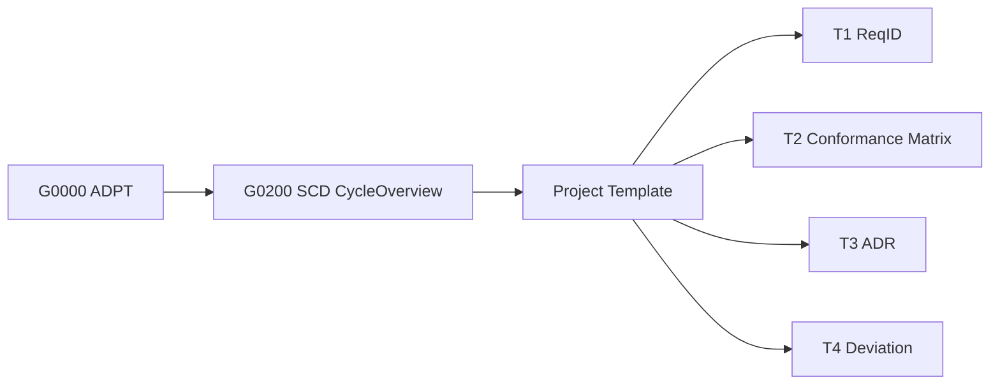

# 🧱 プロジェクト雛型ガイド — *Project Template Overview (v2.0.0)*

**対象範囲:** `1-project-template/`
**上位文書:** [G0000-STD-ADPT-ProjectAdaptationGuide](../0-standards/0-adpt/G0000-STD-ADPT-ProjectAdaptationGuide.md)
**準拠標準:** [G0100-STD-DOC0 DocumentPolicy](../0-standards/1-doc/G0100-STD-DOC0-DocumentPolicy.md), [G0300-STD-COD0 CodingStandard](../0-standards/3-cod/G0300-STD-COD0-CodingStandard.md)

---

## 🎯 1. 目的 / *Purpose*

本ディレクトリは、DocFoundry標準体系に準拠した **新規プロジェクト導入用の雛型構成** を提供します。
あらゆるプロジェクトは、本雛型をコピーすることで、
**標準文書・CI・構成管理の初期状態を即時整備** できます。

> 🚀 *「標準を使ってプロジェクトを始めるための最小単位」*

---

## 🧩 2. ディレクトリ構成

```plaintext
1-project-template/
├── config/                 ← プロジェクト識別・設定ファイル群
│   ├── project-config.yml          # プロジェクトID・参照標準・契約設定
│   └── project-coding-overrides.yml# Core/LANG差異設定（必要時）
│
├── compliance/             ← 標準準拠確認成果物群（T群）
│   ├── T1-ReqID.csv                # 要求IDリスト
│   ├── T2-ConformanceMatrix.csv    # 準拠マトリクス
│   ├── T3-ADR/                     # 設計判断記録（ADR）
│   └── T4-Deviation/               # 標準逸脱記録（Deviation）
│
├── docs/                   ← プロジェクト標準文書（OVR/REQ/ARC/IMP/TST/OPS/SEC/STD）
│   ├── P0100-OVR-Overview.md
│   ├── P0200-REQ-Overview.md
│   ├── P0300-ARC-Overview.md
│   ├── P0400-IMP-Overview.md
│   ├── P0500-TST-Overview.md
│   ├── P0600-OPS-Overview.md
│   ├── P0700-SEC-Overview.md
│   ├── P0800-STD-Overview.md
│   └── index.md
│
├── ci/workflows/           ← 継続的検証（CI/CD）設定
│   ├── core-check.yml              # DCMM準拠・命名規約検証
│   ├── csharp-check.yml            # C#ビルド・テスト実行
│   └── conformance.yml             # 準拠マトリクス収集（T2/T4）
│
├── src/                    ← 実装領域（標準準拠ソース）
└── tests/                  ← テスト領域（自動検証用）
```

---

## ⚙️ 3. 導入・利用手順

| 手順 | 内容 |
|------|------|
| **1️⃣ コピー** | `1-project-template/` を複製して新規PJディレクトリを作成。例：`cp -r 1-project-template project-alpha` |
| **2️⃣ 設定** | `config/project-config.yml` にプロジェクトID・契約方式を記載。 |
| **3️⃣ 差異定義** | 必要に応じ `project-coding-overrides.yml` にCore/LANG差異を明示。 |
| **4️⃣ 文書作成** | `/docs/` 以下のテンプレートに沿って各種文書（OVR, REQ, ARC…）を埋める。 |
| **5️⃣ 検証実行** | `/ci/workflows/` のcore-check / conformance.ymlをCIで実行。 |
| **6️⃣ 結果反映** | `/compliance/` に ReqID, ADR, Deviation, Matrix を保存。 |

---

## 🔗 4. 標準群との関係

| 標準文書 | 適用内容 |
|-----------|-----------|
| **G0000-STD-ADPT** | 本テンプレート全体の導入規約を統制。 |
| **G0100-STD-DOC0** | 文書命名・改訂ポリシーを継承。 |
| **G0200〜G0206** | 各フェーズの開発活動に対応（Spec→Feedback）。 |
| **G0210/G0220** | ReqID・Matrix・ADR・Deviation テンプレート仕様。 |
| **G0300/G0301** | コーディング標準（Core/LANG）に準拠。 |

---

## 🧭 5. SCDモデルとの対応



- 本テンプレートは SCDモデルの「導入インスタンス」。
- 各プロジェクト文書（P0xxx系）は、標準文書（G0xxx系）にトレースされる。
- 変更・逸脱は ADR（T3）により正規化・審査される。

---

## 🧾 6. 運用ポリシー

| 項目 | 方針 |
|------|------|
| **改変禁止領域** | `/ci/workflows/`, `/compliance/T*.csv` のフォーマットは改変不可。 |
| **差異承認** | `project-coding-overrides.yml` で明記＋ADRで承認。 |
| **CI義務** | 全プロジェクトはcore-check / conformanceを定期実行（MUST）。 |
| **更新ルール** | standardsのバージョンはタグ固定（例：v3.0.0）。 |
| **Feedback** | G0206-STD-SCD6-FeedbackPhaseに基づき改善を登録。 |

---

## 🪜 7. 将来運用構想

| フェーズ | 内容 |
|----------|------|
| **Phase 1** | 本テンプレートを直接コピーして利用（初期導入） |
| **Phase 2** | standardsを独立リポジトリ化し、Submodule参照に移行 |
| **Phase 3** | CIによる標準準拠自動検証を組織横断で運用 |

---

## 🧩 8. 改訂履歴

| 版 | 日付 | 内容 |
|----|------|------|
| v1.0.0 | 2025-10-26 | 初版。project-template構成の整備。 |
| v2.0.0 | 2025-10-27 | G0000メタ標準・SCDモデル適合版に更新。構成説明を体系化。 |

---

**Status:** Stable
**Lifecycle:** Canonical
**Location:** `1-project-template/README.md`
**上位文書:** [G0000-STD-ADPT](../0-standards/0-adpt/G0000-STD-ADPT-ProjectAdaptationGuide.md)

---

このREADMEは、DocFoundry標準体系における
「プロジェクト適用層」の正式定義文書として使用可能です。
