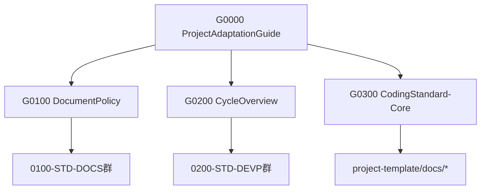

# 🧭 リポジトリ概要 — *DocFoundry Integrated Repository*

> 本リポジトリの全標準文書は **G0100-STD-DOC0（Document Policy）** および  
> **G0101-STD-DOC1（Compliance Pack）** に準拠して作成されています。  
> これらを基準として文書管理・CI自動検証が行われます。

**構成対象:** `standards/` + `project-template/`
**改訂目的:** メタ標準（G0000-STD-ADPT）および SCDモデル（Spec–Conformance Development）準拠の体系に統一。

---

## 📘 1. 概要 / *Overview*

このリポジトリは、
**開発標準文書群（standards）** と **プロジェクト雛型（project-template）** を統合した「導入一体型構成」です。

小規模導入や初期段階での標準運用を想定しており、
**2件目以降のプロジェクト開始時に standards を独立リポジトリ化** することを前提としています。

---

## 📂 2. ディレクトリ構成

```plaintext
repo-root/
├── 0-standards/
│   ├── 0-adpt/
│   ├── 1-doc/
│   ├── 2-scd/
│   ├── 3-cod/
│   └── README.md
│
├── 1-project-template/
│   ├── config/
│   ├── compliance/
│   ├── docs/
│   ├── ci/workflows/
│   ├── src/
│   └── tests/
│
└── README.md
```

---

## 🎯 3. 目的と適用範囲

| 項目 | 内容 |
|------|------|
| **目的** | 標準文書群とテンプレート群を統合管理し、統一されたSCDモデルに基づくプロジェクト導入を支援する。 |
| **適用対象** | すべてのDocFoundry準拠プロジェクト。 |
| **上位文書** | G0000-STD-ADPT（Project Adaptation Guide） |
| **関連文書** | G0100（Document Policy）, G0200（Cycle Overview）, G0300（Coding Standard） |

---

## ⚙️ 4. 運用ポリシー

| 項目 | 方針 |
|------|------|
| **standards/** | 標準化チーム専用領域。プロジェクト側は改変禁止（MUST）。 |
| **project-template/** | 新規プロジェクトの初期構成テンプレート。コピー利用を前提。 |
| **改変手続き** | Pull Request＋レビュー＋タグ発行（Semantic Versioning準拠）。 |
| **コードオーナー** | `/0-standards/**` は CODEOWNERS により標準チーム専権。 |
| **差異管理** | `project-coding-overrides.yml` にて Core/LANG 差異を明記（ADR必須）。 |
| **承認責任** | 自動検証（CI）＋人間承認（Human-in-the-Loop）を併用。 |

---

## 🚀 5. 利用手順（新規プロジェクト開始時）

1️⃣ `1-project-template/` をコピーし、新規PJディレクトリを作成
　例：`cp -r 1-project-template project-alpha`

2️⃣ `config/project-config.yml` を編集し、プロジェクト識別子・契約方式を定義。
3️⃣ 必要に応じて `project-coding-overrides.yml` に差異を定義。
4️⃣ `/docs/` 以下の雛型を用いて OVR, REQ, ARC, IMP, TST, OPS, SEC 文書を作成。
5️⃣ `/ci/workflows/` の CI を実行し、Core／Lang／Conformance 検証を実施。
6️⃣ `/compliance/` に ReqID / Matrix / ADR / Deviation を記録。

---

## 🔗 6. 標準との関係

- **参照優先順位**
  1. G0300（Coding Standard – Core）
  2. G0301（Language Module – C# 等）
  3. project-coding-overrides.yml（差異定義）

- **不整合時の扱い**
  - Core／Lang に反する差異は ADR（T3）で承認必須。
  - 差異は有効期限を設定し、FeedbackPhase（G0206）で再評価。

---

## 🪜 7. 将来移行計画（複数PJ運用時）

| ステップ | 内容 |
|----------|------|
| 1️⃣ | `/0-standards` を独立リポジトリ化（例：`org-standards`）。 |
| 2️⃣ | 本リポジトリから standards を削除し、submodule／release ZIP で参照。 |
| 3️⃣ | 各プロジェクトでタグ固定参照（例：`v3.0.0`）を設定。 |
| 4️⃣ | CIに standards バージョン整合チェックを追加。 |
| 5️⃣ | 変更理由を ADR（T3）で記録し、Conformance Matrix（T2）で検証。 |

---

## 🧩 8. 関連構造（Mermaid）



---

## 📄 9. 管理情報

| 項目 | 内容 |
|------|------|
| **管理責任者** | Documentation Team / QA |
| **バージョン** | v3.1.0 |
| **ライフサイクル** | Stable |
| **上位文書** | G0000-STD-ADPT |
| **リリース形態** | 同居構成（統合パッケージ） |
| **連絡先** | standards@org.example |

---

## 🧾 10. 改訂履歴

| 版 | 日付 | 内容 |
|----|------|------|
| v1.0.0 | 2025-10-26 | 初版。standards＋project-template同居構成を正式化。 |
| v3.1.0 | 2025-10-27 | G0000メタ標準および現行SCDモデル準拠に更新。階層構成・用語を統一。 |

---

### 💡 今後の推奨補足
- CODEOWNERS と release tagging 規約を補足文書として追加（例：`G0103-STD-OPS-CODEOWNERS.md`）
- standards リポジトリ分離後は、本README を `org-docfoundry-template/` 側に移設予定。
