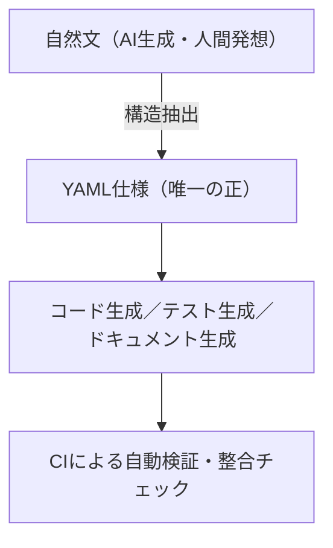

# YAML活用方針書（汎用開発標準 / AI協働対応版）

## 1. 目的

本方針は、プロジェクト全体における  
**仕様・設計・生成・検証の基盤形式として YAML を原則とする** ことを目的とする。  
これにより、開発資産の一貫性・再現性・自動化を確立し、仕様の統一的な運用を支える。

---

## 2. 基本理念

| 原則 | 内容 |
|---|---|
| **YAML原則主義** | 開発に関わるすべての仕様定義・構成情報は YAML 形式で記述することを原則とする。 |
| **唯一の正（Single Source of Truth）** | `.yaml` を唯一の仕様ソースとし、すべての生成・参照の基点とする。 |
| **自動生成主義** | コード・テスト・ドキュメントは YAML から自動生成し、手作業による差異を排除する。 |
| **人機両可読性** | YAMLは人間と機械の双方に理解可能な構造を保つ。 |
| **追跡可能性（Traceability）** | `doc_id`, `goal_id`, `req_id` などの識別子を生成物に埋め込み、仕様との対応を明示する。 |
| **変更一元管理** | すべての変更は YAML を起点とし、生成物の直接編集を禁止する。 |
| **AI補助一貫性原則** | AIによる仕様生成・補完もYAML形式に統一し、スキーマ検証を通じて構造的再現性を保証する。 |

---

## 3. 運用原則

### 3.1 標準フロー



### 3.2 編集責務

- **編集対象**：すべての YAML ファイル（唯一の正）  
- **生成物の直接編集**：禁止（CIで検出・エラーとする）  
- **人間可読文書からのYAML化**：初期導入時に限定  
- **以降の更新**：YAML → 自動生成 の一方向フローを厳守する  

### 3.3 YAML化導入基準

既存の要件・設計書をYAML化する場合は次の基準に従う：  
- 初期導入時のみ実施し、運用定着後はYAMLを唯一の編集対象とする。  
- 変換担当は各ドメイン責任者（CODEOWNER）が指名する。  
- 変換後のYAMLは必ずCI検証を通す。  
- 原文（Word/Markdown）は「参考アーカイブ」として保存し、以後の更新は禁止。  

### 3.4 仕様書とYAMLのセット運用

- すべての仕様定義は、YAML仕様（唯一の正）と人間可読仕様書（Markdown等）をセットで管理する。  
- YAMLを編集した場合、仕様書は自動生成またはテンプレート同期により更新する。  
- YAMLと仕様書の不整合はCIで検出し、整合性エラーとして扱う。  
- 仕様書は参照用ドキュメントとして扱い、直接編集を禁止する。  
- 「仕様書 ⇄ YAML」対応関係は `doc_id` でトレース可能とする。  

---

## 4. 人間可読文書との関係

既存の要件定義書や設計書などを YAML形式にする。

---

## 5. YAML構文規約（基本ルール）

| 項目 | 規則 |
|---|---|
| エンコード | UTF-8（BOMなし） |
| インデント | 半角スペース2 |
| 改行コード | LF固定 |
| 真偽値 | `true` / `false` のみ許可 |
| 日付 | ISO 8601形式（例：`"2025-11-04T00:00:00+09:00"`） |
| コメント | `# ` で開始し、構造保持を妨げない内容とする |
| ファイル命名 | `lower-kebab-case.yaml` |
| 禁止事項 | タブ / 重複キー / 曖昧ブール値（`yes`, `no`, `on`, `off`） |

---

## 6. YAML構造標準および配置規約

YAML仕様ファイルは、以下の標準ディレクトリ構成に従う。

```text
/specs/
  /domain/
    - entity-name.yaml         # 各エンティティ仕様
  /schema/
    - entity-name.schema.yaml  # JSON Schema
  /meta/
    - ai-meta.yaml             # AI補助メタ情報
```

- 「1仕様 = 1ファイル」を原則とする。  
- schema, meta 等は対応する仕様と同名とする。  
- 拡張子は `.yaml` に統一する。  

---

## 7. 品質保証およびCI検証

| 検証項目 | 方法 | 成否条件 |
|---|---|---|
| 構文検証 | `yamllint`, `jsonschema` | エラーがないこと |
| 意味検証 | 独自検証スクリプト（例：`validate-yaml.py`） | YAML間の参照整合性が取れている |
| 差分検証 | `git diff --exit-code` | 生成物に手動変更がない |
| トレーサビリティ | `doc_id`, `goal_id`, `req_id` の一致 | 全生成物に反映されていること |
| 自動生成ヘッダ検証 | `"AUTO-GENERATED"` ヘッダを保持 | 改変時にFail |
| Prose編集検知 | CIチェック | Markdown等の直編集がないこと |
| AI出力整合性 | `ai_meta` のスキーマ整合チェック | モデル情報・生成日時・プロンプト履歴が保持されていること |
| AI再現性検証 | AI再実行スクリプト | 同一入力で同一YAMLが再生成されること |

---

## 8. 拡張と応用

- **型付きYAML（Typed YAML）** や **Schema付きYAML** の採用を推奨。各項目の型・制約・必須性を宣言的に管理する。  
- **DSL（Domain Specific Language）** の基礎構文としてYAMLを活用可能。  
- **AI・自動化ツール** は、`ai_meta` 等の補助情報をYAML内に保持して参照できる。  
- YAML → JSON / Graph / Model変換を通じて自動生成プロセスを高度化することを想定する。  

### 8.1 Schema進化方針

- 破壊的変更（Breaking Change）は `schema_version` をメジャーアップとする。  
- 下位互換維持が困難な場合は、旧バージョンを `/deprecated/` 配下に保存。  
- Schema変更時は必ず生成対象のコード／テストを再生成・再検証する。  

---

## 9. 運用体制

| 区分 | 内容 |
|---|---|
| 責任範囲 | 各ドメイン所有者（CODEOWNERSで明示） |
| 更新単位 | 「1仕様 = 1PR」原則 |
| 承認手続 | CI成功＋レビュー承認により確定 |
| 廃止管理 | `lifecycle: deprecated` を明記 |
| バージョン管理 | Semantic Versioning（例：`1.0.0`）準拠 |

### 9.1 教育・レビュー体制

- 各ドメインに「YAMLメンテナ」を置き、更新時レビューを担当する。  
- 教育責任者は全体標準の維持および新人教育を担う。  
- 半期ごとに標準更新と教育セッションを実施する。  
- YAMLメンテナはAI出力の品質検証およびスキーマ準拠の確認を行う責務を持つ。  

### 9.2 仕様書同期ルール

- 各YAML仕様は対応する仕様書（Markdown）を必ず持つ。  
- 両者は同一 `doc_id` により対応付けされる。  
- CIパイプラインでYAML→仕様書自動生成を行い、差分を検証する。  
- 手動で仕様書のみを変更する行為は禁止する。  
- 仕様書の目的は「レビュー・共有・可読性の確保」であり、内容の正はYAMLに従う。  

### 9.3 運用方向性の固定（片方向原則）

- 本方針における情報流通は **「可読文書 → YAML → 成果物」** の片方向フローに限定する。  
- 一度YAMLとして定義された仕様を、可読文書や他形式から再変換して上書きする行為を禁止する。  
- YAML以外の形式から仕様情報を反映する場合は、新規仕様として別 `doc_id` を発行し、再審査を経る。  

---

## 10. まとめ

- YAMLは開発資産を「構造化し、再現性を保つ」ための標準形式である。  
- 本方針では、開発プロジェクトのすべての仕様記述・定義を **YAMLを原則** として運用する。  
- コード・テスト・ドキュメントはすべて **YAMLを唯一の正** として再生成可能に保つ。  
- この運用により、チーム間での仕様共有、CI/CD整合性、AI支援による自動化が容易になる。  
- **形式よりも運用の一貫性**を重視し、YAMLを「仕様の言語」として長期運用する。  
- **YAMLは人間とAIの共有言語であり、両者の協働によって仕様・生成・検証の全工程が一貫性と再現性を持つ。**  

---

## 11. AI支援開発との整合

- 本方針は AI（LLM、自動生成ツール等）による仕様生成・補助作業を正式に前提とする。  
- AI出力は YAMLスキーマに基づく構造的生成を原則とし、自然言語出力のみの仕様は暫定扱いとする。  
- AI生成YAMLは、必ずスキーマ検証（`jsonschema`, `yamllint` 等）を通して登録する。  
- AI出力の文脈・生成条件は `ai_meta` に保持し、再現性・説明責任を担保する。  
- 「創造は自然文で、確定はYAMLで」を原則とし、確定仕様はYAMLを唯一の正とする。  

---

## Appendix: ai_metaサンプル

```yaml
ai_meta:
  purpose: "DTO自動生成のための構造定義"
  generator: "ChatGPT / LangChain"
  model: "gpt-5"
  version: "2025.11.0"
  context:
    input_format: "YAML"
    output_format: "C# DTO"
  authoring:
    maintainer: "Documentation Team"
    created_at: "2025-11-04T00:00:00+09:00"
```

---

### ✅ 推奨文書名

`YAML-Usage-Policy(General-Edition-AI).md`
