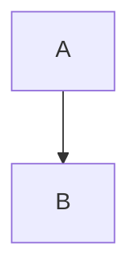

# [STD-DOC0] ドキュメント書式標準 第2巻（Vol.02）

## 収録章
- 第4章：文書構造とメタデータ
- 第5章：Markdown書式標準
- 第6章：禁止事項

---

## 4. 文書構造とメタデータ（structure--metadata）
<a id="4"></a>

文書構造に関する規則を定義し、Front Matter・目次・改訂履歴など DocFoundary 標準文書に共通する枠組みを規定する。

### 4.1 目次（table-of-contents）
<a id="4-1"></a>

目次（TOC）は文書構造を正確に示すために必須要素であり、以下の条件を満たす（MUST）。

- Front Matter の直後に置く
- Markdown のリンク付きリスト形式を使用
- 階層は1〜3階層に限定
- アンカー名は章番号のみにする（例：`#4-2`）

---

### 4.2 Front Matter 構造と固定仕様（creativework-schema）
<a id="4-2"></a>

Front Matter は Schema.org の `CreativeWork` を採用し、次の9キーのみで構成する（固定）。

| キー | 必須 | 変更可 | 説明 |
|------|------|--------|------|
| schema | ✓ | ✗ | 固定値 "https://schema.org/CreativeWork" |
| @type | ✓ | ✗ | 固定値 "CreativeWork" |
| identifier | ✓ | ✓ | 文書ID（ファイル名と一致） |
| name | ✓ | ✓ | 日本語タイトル（単言語） |
| version | ✓ | ✓ | セマンティックバージョン |
| datePublished | ✓ | ✓ | ISO8601 |
| inLanguage | ✓ | ✗ | 固定 `["ja"]` |
| creator | ✓ | ✗ | 固定構造（Person, Individual Developer） |
| description | ✓ | ✓ | 日本語要約（1〜3文） |

---

#### 4.2.1 CreativeWorkスキーマ定義
<a id="4-2-1"></a>

CreativeWork 構造の固定テンプレート：
```
---
schema: "https://schema.org/CreativeWork"
"@type": "CreativeWork"
identifier: "***"
name: "***（日本語タイトル）"
version: "***"
datePublished: "***"
inLanguage: ["ja"]
creator:
  "@type": "Person"
  name: "Individual Developer"
description: "***（日本語1〜3文）"
---
```

---

#### 4.2.2 バリデーション規則
<a id="4-2-2"></a>

| キー | 検証条件 |
|------|----------|
| identifier | 正規表現：`^G[0-9]{4}-[A-Z]{3}-[A-Z0-9]{3,}-[A-Za-z0-9\\-]+$` |
| version | `^v\\d+\\.\\d+\\.\\d+$` |
| datePublished | ISO8601 |
| inLanguage | `["ja"]` 固定 |
| creator | const構造 |

---

### 4.3 バージョンと改訂履歴
<a id="4-3"></a>

改訂履歴は 00番（総合編）で一元管理し、各巻および各章では記載しない（MUST NOT）。

---

## 5. Markdown書式標準（markdown-formatting-standard）
<a id="5"></a>

DocFoundary 標準文書で使用する Markdown の書式仕様を定義する。

### 5.1 表記詳細ルール（formatting-details）
<a id="5-1"></a>

| 項目 | 要件 | 規範性 |
|------|------|--------|
| 表（Tables） | Markdown表を使用。セル改行禁止。 | MUST |
| コードブロック | ``` + 言語名を指定 | MUST |
| 引用 | `>` 1段のみ | MUST |
| 日付形式 | ISO8601 | MUST |
| 改行 | 半角スペース2個＋LF。ハードラップ禁止 | MUST |
| 内部リンク | 章番号アンカーのみ使用 | MUST |
| 外部リンク | 文書ID完全指定（例：G0300-ARC-COD0#3-1） | MUST |

---

#### 5.1.1 表（Tables）
<a id="5-1-1"></a>
標準 Markdown 記法に従う。外枠線・結合セルは禁止。

#### 5.1.2 コードブロック（Code Blocks）
<a id="5-1-2"></a>
必ず言語名を指定：
```
```yaml
```

#### 5.1.3 引用（Blockquote）
<a id="5-1-3"></a>
1段構造のみ。引用中に表・画像を含めない。

---

### 5.2 図表記法（Mermaid）
<a id="5-2"></a>

Mermaid 記法は textベース図表として使用する（SHOULD）。

#### 5.2.1 基本構文と制約

````

````

- JavaScript挿入禁止
- GFM互換範囲で記述

### 5.2.2 図種と用途
- Flowchart
- Sequence Diagram
- Class Diagram
- ER Diagram

---

## 5.3 多言語表記
<a id="5-3"></a>
Front Matter のみ言語仕様を定義し、本文中の多言語方針は DOC1 に委譲する。

---

# 6. 禁止事項（prohibited-items）
<a id="6"></a>

- `.md` 以外の拡張子禁止
- 非標準キーを Front Matter に追加禁止
- 章番号／Vol番号の重複禁止
- H1タイトルとファイル名の不一致禁止
- 状態管理キー（例：status）を追加禁止
- 改訂履歴を分冊側に記述禁止（00のみ許可）

