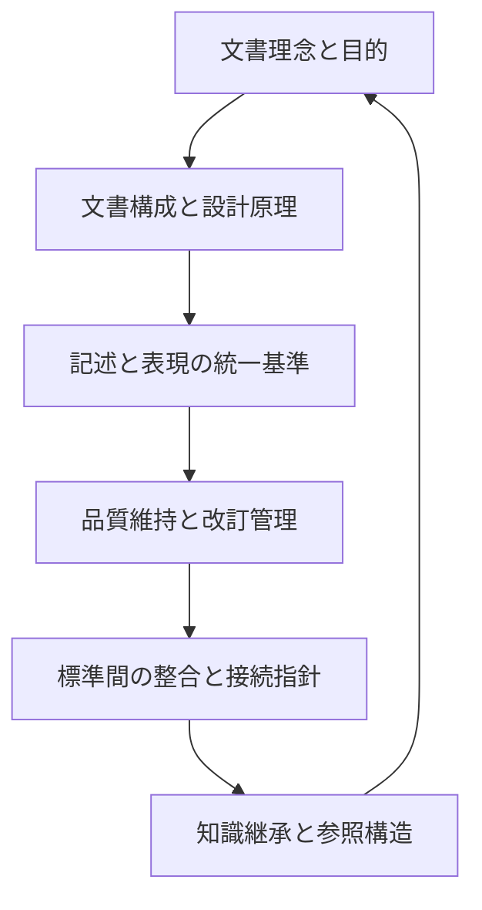

# [STD-DOC1] 文書設計指針（Documentation Authoring Guideline / v2.1.0）

## 目次（Table of Contents）

* [1. 文書理念と目的（Purpose and Context）](#1)

  * [1.1 背景と目的](#1-1)
  * [1.2 適用範囲](#1-2)
* [2. 文書構成と設計原理（Document Structure Principles）](#2)

  * [2.1 章構成原則](#2-1)
  * [2.2 論理構造](#2-2)
* [3. 記述と表現の統一基準（Expression and Style Guide）](#3)

  * [3.1 言語・文体ルール（Language and Tone）](#3-1)
  * [3.2 構文と書式（Syntax and Formatting）](#3-2)
  * [3.3 図表とコード記法（Figures and Code Notation）](#3-3)
* [4. 品質維持と改訂管理（Quality and Maintenance）](#4)

  * [4.1 品質保証と改訂手順](#4-1)
  * [4.2 継続的改善](#4-2)
* [5. 標準間の整合と接続指針（Integration Directive）](#5)

  * [5.1 標準群内整合](#5-1)
  * [5.2 外部規格との関係](#5-2)
  * [5.3 役割分担サマリー（G0100 vs G0110）](#5-3)
* [6. 知識継承と参照構造（Knowledge Inheritance and Reference）](#6)

  * [6.1 継承と更新](#6-1)
  * [6.2 継続的整合サイクル](#6-2)
* [各層の要約概要表（Summary of Meta Layers）](#summary)
* [附録. 参考文書（Referenced Standards）](#A)
* [Revision History（改訂履歴）](#rev)

---

## 1. 文書理念と目的（Purpose and Context）

本章は、DocFoundary 標準群における文書作成理念と目的を定義する。内容層（Authoring Layer）における記述品質・再現性・整合性を高水準で維持することを目的とする。

### 1.1 背景と目的

* 標準文書間での記述一貫性を確立し、文体の揺らぎを排除する。
* 内容層文書（REQ, ARC, OPS, SEC, RPT, REF）の共通原理を提示する。

### 1.2 適用範囲

* 対象：全DocFoundary文書群の著述および再現可能な知識設計。
* 非対象：自動生成スクリプト、実装コード等の非内容層資料。

---

## 2. 文書構成と設計原理（Document Structure Principles）

### 2.1 章構成原則

* 各文書は理念・構造・表現・運用・統合・参照の六階層に準拠する（MUST）。
* 章番号体系はG0100と一致させ、欠番を許可しない（MUST）。
* H1はタイトルのみ、H2は章、H3は節とし、H4以降は禁止（MUST NOT）。
* 見出しアンカーは章番号のみを用い、英語スラッグは付さない（MUST）。
* 本原則は G0100 4.1節の目次階層規定に整合する（REF: G0100-STD-DOC0）。

### 2.2 論理構造

1. 文書理念 — なぜこの文書が存在するか。
2. 文書構成 — どのように章体系を整理するか。
3. 表現基準 — どのように記述・表現するか。
4. 管理運用 — どのように維持・改訂するか。
5. 整合指針 — 他標準との接続をどう保つか。
6. 参照構造 — どのように知識を継承するか。

---

## 3. 記述と表現の統一基準（Expression and Style Guide）

### 3.1 言語・文体ルール（Language and Tone）

* 日本語文体は「〜である」調に統一し、敬体（です・ます）は禁止（MUST）。
* RFC2119の規範語（MUST／SHOULD／MAY）を統一的に使用する（MUST）。
* カタカナ語を避け、原語表記（英語）を優先する（SHOULD）。

#### (1) 英語併記の目的と原則

DocFoundary 標準文書は日本語を正本とする（`inLanguage: ["ja"]`）。理解補助や国際的用語の明確化のために限り、英語を補助的に併記してよい（SHOULD）。

* 英語が国際的に確立している技術用語（Front Matter, Markdown, YAMLなど）は **英語表記を主とする（MUST）**。
* 日本語訳が自然な場合は日本語を主とし、括弧内に英語を併記してよい（SHOULD）。
* 同一文書内で表記形を混用してはならない（MUST NOT）。

#### (2) 見出しでの扱い

* 見出しは原則として日本語のみを用いる（MUST）。
* 以下の場合のみ英語の併記を許可する（SHOULD）：

  1. 英語の方が国際的に認知された正式名称である場合（例：`Front Matter Structure`）
  2. 日本語訳のみでは意味が不明瞭または誤解を招くおそれがある場合
  3. 外部仕様や他標準文書との参照整合性を保つ必要がある場合
* アンカーは章番号のみ（例：`#4-2`）を使用し、英語スラッグは付さない（MUST）。

#### (3) 用語の初出と固有名詞

* 用語の初出時に限り日英併記を許可する（例：フロントマター（Front Matter））。
* 以降は主表記（日本語または英語）に統一する（MUST）。
* 固有名詞・規格名（GitHub、CommonMarkなど）は原綴りを維持する（MUST）。

> **Summary:**
> G0100 = 形式的な言語指定のルール
> G0110 = 文中・見出し・用語レベルでの多言語表現ルール
> （本節は G0100 の形式的多言語仕様を補完し、内容表現方針を明示する）

#### (4) 文中訳語・略語の扱い

* 専門語・略語には初出時に括弧付き説明を付す（MUST）。
* カタカナ語の多用を避け、英語原語または正式な日本語訳を優先する（SHOULD）。

#### (5) ファイル名と文書名の関係

* ファイル名は英字・数字・ハイフンのみで構成する（MUST）。日本語・全角文字・空白は使用しない。
* 文書名（Front Matter の `name`）および H1 見出しは日本語で記載する（MUST）。

> **例:**
> ファイル名：`G0110-STD-DOC1-AuthoringGuideline.md`
> 文書名：`文書作成指針（vX.Y.Z／…）`

### 3.2 構文と書式（Syntax and Formatting）

* リスト記号は `-` を推奨し（SHOULD）、番号付きリストは手順説明に限る（SHOULD）。
* 引用は `>` 一段階まで許可し、多段引用は禁止（MUST）。
* コードブロックは三重バッククォートで囲み、言語名を明示する（MUST）。
* 表はMarkdown標準構文のみを使用し、セル内改行や罫線の装飾は禁止（MUST）。
* 行末改行は「半角スペース2個＋LF」とする（MUST）。

### 3.3 図表とコード記法（Figures and Code Notation）

* Mermaid図表は G0100 5.2節（Mermaid記法）に準拠する（MUST）。
* 図表にはタイトル行（例：`%% 図3-1：構造概要`）を必ず記載する（MUST）。
* 図表番号・表番号は「図n-m」「表n-m」とし、章番号に連動させる（SHOULD）。
* コード例には動作保証を伴わない説明目的の注記を付す（SHOULD）。

---

## 4. 品質維持と改訂管理（Quality and Maintenance）

### 4.1 品質保証と改訂手順

* 改訂時は必ず改訂履歴を更新し、降順で記載する（MUST）。
* 公開前に自己検証（DOC0-CHK）を実施し、構文・文体の一貫性を確認する。
* markdownlint等のLintツールで自動検証することを推奨（SHOULD）。

### 4.2 継続的改善

* 文書品質は再現可能性と追跡可能性に基づく（MUST）。
* 改訂内容が他文書に影響する場合、相互参照を更新する（SHOULD）。

---

## 5. 標準間の整合と接続指針（Integration Directive）

### 5.1 標準群内整合

* G0000（全体指針）を理念層として参照する（MUST）。
* G0100（書式標準）を形式層として参照する（MUST）。
* 他の内容層（ARC, REQ, OPSなど）とは相互補完関係を保持する（SHOULD）。

### 5.2 外部規格との関係

* 外部標準（例：ISO、RFC、CommonMark）は参照層で補足し、直接依存を避ける。

### 5.3 役割分担サマリー（G0100 vs G0110）

> **要旨:**
> G0100 = 形式と書式、目次階層、言語指定
> G0110 = 文中・見出し・用語レベルの表現統制、英語併記方針

---

## 6. 知識継承と参照構造（Knowledge Inheritance and Reference）

### 6.1 継承と更新

* 各文書は参照文書リストを保持し、更新時に整合を確認する（MUST）。
* 継承経路を文末附録に明示し、知識構造の再利用を可能にする。

### 6.2 継続的整合サイクル

> 参照層の知識更新が理念層へ循環し、標準群全体の継続的整合を形成する。

---

## 各層の要約概要表（Summary of Meta Layers）

| 層名              | 英語名             | 主目的                  | 各章での内容                 | 主な規範語  |
| --------------- | --------------- | -------------------- | ---------------------- | ------ |
| **文書理念と目的**     | Why             | 文書の存在意義・背景・目的を定義する   | 第1章で背景・目的・適用範囲を明記      | MUST   |
| **文書構成と設計原理**   | How to Organize | 文書の論理構造・章体系・階層整合を定義  | 第2章で章構成原則・論理構造を示す      | MUST   |
| **記述と表現の統一基準**  | How to Describe | 文体・用語・書式・図表・コード記法を統一 | 第3章で言語・構文・図表記法を統制      | MUST   |
| **品質維持と改訂管理**   | How to Maintain | 品質保証・改訂手順・検証方法を明確化   | 第4章で改訂履歴・Lint検証を規定     | SHOULD |
| **標準間の整合と接続指針** | How to Connect  | 他標準文書や外部規格との関係を整理    | 第5章でG0100・G0000との整合を示す | SHOULD |
| **知識継承と参照構造**   | How to Inherit  | 知識の継承・参照・更新の連鎖を定義    | 第6章で継承経路・整合サイクルを示す     | MUST   |

---

## 附録. 参考文書

| 文書ID                        | 名称                         | 関係            |
|------------------------------|------------------------------|-----------------|
| G0000-STD-OVRV-OverView      | ドキュメント標準 全体概要・理念 | 上位理念層       |
| G0100-STD-DOC0-FormatPolicy  | ドキュメント書式標準           | 形式層基準       |
| G0400-STD-YML0-ContentStructure | YAML 内容構造標準            | 内容層基準       |
| G0410-STD-YML1-LayerModel    | YAML 三層モデル               | 構造理念層       |
| G0420-STD-YML2-SyntaxStyleGuide | YAML 記述スタイル標準        | 記述スタイル基準 |
| G0120-STD-DOC2-DocumentOperation | 文書運用標準               | 運用層基準       |

---

## Revision History

| 版      | 日付           | 内容                                                |
| ------ | ------------ | ------------------------------------------------- |
| v2.1.0 | "2025-11-11" | 引用・表・箇条書き・用語・RFC2119語の統一を完了し、正式公開仕様に整備。           |
| v2.0.2 | "2025-11-11" | 章タイトルを自然言語指向にリネームし、読者に直感的な章構造へ調整。                 |
| v2.0.1 | "2025-11-11" | v1.1.0の規定を復元・統合（英語併記条件、アンカー方針、書式・図表・コード規定、改行規定等）。 |
| v2.0.0 | "2025-11-11" | 内容層六階層モデルに基づき全文を再構成。理念・構造・表現・運用・統合・参照の体系を整備。      |
| v1.2.0 | "2025-11-11" | 附録Cを第6章へ昇格。内容層構成規定を本文化。                               |
| v1.1.0 | "2025-11-11" | 記述原則とスタイルガイドを中心に再構成。                                  |
| v1.0.0 | "2025-11-11" | 初版作成。                                                 |
