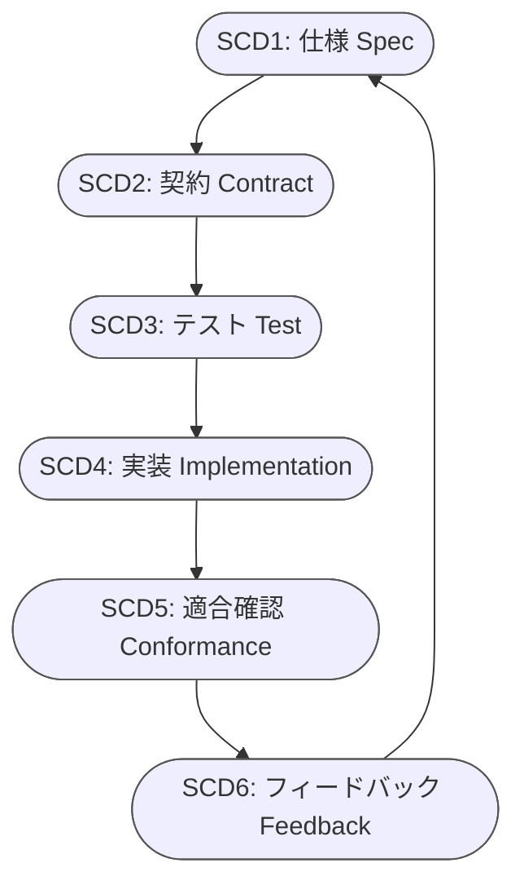

---

schema: "[https://schema.org/CreativeWork](https://schema.org/CreativeWork)"
@type: "CreativeWork"
identifier: "G0200-STD-SCD0"
name: "開発サイクル概要（Spec–Conformance Development Cycle）"
version: "v1.2.0"
datePublished: "2025-11-11"
status: "Approved"
creator:
@type: Organization
name: "Documentation Team"
reviewers:

* "Quality-Assurance-Guild"
* "Product-Compliance-Board"
  confidentiality: "Public"
  lifecycle: "Canonical"
  scope: "Generic"
  owner: "Standards-Governance-Team"
  inherit_from: ["G0100-STD-DOC0"]

---

# [SCD-CYCL] 開発サイクル概要（Spec–Conformance Development Cycle）

**Version:** v1.2.0
**Date:** 2025-11-11
**Status:** Approved

---

## 📑 目次 / *Table of Contents*

1. [序章：文書概要](#1-序章文書概要)
2. [理念と原則](#2-理念と原則)
3. [サイクル構造とフェーズ概要](#3-サイクル構造とフェーズ概要)
4. [トレーサビリティと責任体系](#4-トレーサビリティと責任体系)
5. [教育・改善体系](#5-教育改善体系)
6. [Annex I：教育補助構造（概念モデル）](#annex-i教育補助構造概念モデル)
7. [Annex II：参照体系構造（Cross-Reference Framework）](#annex-ii参照体系構造cross-reference-framework)
8. [Annex III：継続整合の評価原則](#annex-iii継続整合の評価原則)
9. [Annex IV：承認体系の原則](#annex-iv承認体系の原則)
10. [Annex V：運用連携の位置づけ](#annex-v運用連携の位置づけ)
11. [Annex VI：承認条件（Definition of Done）](#annex-vi承認条件definition-of-done)
12. [改訂履歴](#改訂履歴--revision-history)

---

## 1. 序章：文書概要

本書は、開発活動を **Spec–Conformance Development Cycle（SCD）** として定義し、
仕様（Spec）→ 契約（Contract）→ テスト（Test）→ 実装（Implementation）→ 適合確認（Conformance）→ フィードバック（Feedback）
の循環構造を示す。これは DocFoundary 標準の中心的サイクルであり、全開発活動における再現可能性と継続的整合を目的とする。

---

## 2. 理念と原則

### 2.1 基本理念

* **Continuous Conformance（継続整合）** を核とする。
  → 開発の全段階で「検証 → 修正 → 再整合」を繰り返す。
* **動的品質管理** への転換。
  → 静的なレビュー中心の品質保証から、循環的・実証的品質保証へ。

### 2.2 運用原則

| No | 原則                     | 内容                    |
| :- | :--------------------- | :-------------------- |
| 1  | Contract-First         | 契約仕様を先に固定し、他要素がそれに従う。 |
| 2  | Single Source of Truth | 契約仕様を唯一の基準とする。        |
| 3  | Test-Driven            | 仕様はテストで動作を示す。         |
| 4  | Traceable              | 要求から検証まで追跡可能であること。    |
| 5  | Feedback-Oriented      | 検証結果が仕様へ戻る。           |

---

## 3. サイクル構造とフェーズ概要

### 3.1 開発サイクル（Mermaid表示）

### 3.2 フェーズ構成

| コード  | フェーズ名               | 目的                            | 成果物              |
| :--- | :------------------ | :---------------------------- | :--------------- |
| SCD1 | 仕様 (Spec)           | 要求を形式化し、次工程へ渡す基礎を作る           | 要求一覧、仕様書         |
| SCD2 | 契約 (Contract)       | Schema／Interfaceを確定し他工程の基準を提供 | 契約仕様書、データモデル     |
| SCD3 | テスト (Test)          | Example仕様を作成し、動作を明確化          | Example仕様、テストケース |
| SCD4 | 実装 (Implementation) | テストを通過する最小実装を作成               | ソースコード、変更記録      |
| SCD5 | 適合確認 (Conformance)  | 自動検証により整合を確認                  | 検証ログ、Matrix      |
| SCD6 | フィードバック (Feedback)  | 結果を仕様・設計へ還流                   | 改訂仕様、ADR         |

### 3.3 テンプレート対応（T1〜T4）

| テンプレート                 | 用途    | 関連フェーズ    |
| :--------------------- | :---- | :-------- |
| T1: ReqID              | 要求定義  | SCD1      |
| T2: Conformance Matrix | 整合検証  | SCD3〜SCD5 |
| T3: ADR                | 判断記録  | SCD2〜SCD6 |
| T4: Deviation Record   | 不適合記録 | SCD5〜SCD6 |

---

## 4. トレーサビリティと責任体系

### 4.1 トレーサビリティ軸

> 要求 → テスト → 実装 → 検証 → 仕様更新 の流れを維持する。
> すべての成果はこの連鎖の中で相互検証される。

### 4.2 責任体系

| 項目      | 主担当       | AI補助       | 最終判断 |
| :------ | :-------- | :--------- | :--- |
| 仕様定義    | 要求分析者     | 曖昧語検出      | 人間   |
| 契約確立    | 設計者       | Schema整合判定 | 人間   |
| テスト設計   | QA／テスター   | Example提案  | 人間   |
| 実装      | 開発者       | 差分要約       | 人間   |
| 適合確認    | QA／CI管理者  | 自動検証       | 人間   |
| フィードバック | プロジェクト責任者 | 要約・分析      | 人間   |

---

## 5. 教育・改善体系

### 5.1 教育レベル構造

L1（基礎） → L2（実務） → L3（監査）の3層構造。

* L1: 構造と用語を理解する。
* L2: 各フェーズの実務を遂行できる。
* L3: 開発と品質を監査・教育できる。

### 5.2 改善フィードバック

* 教育で得られた知見 → フィードバック工程へ。
* フィードバック結果 → 教育資料へ反映。
  → 開発と教育を循環的に接続することで、プロセスと知識の両輪を維持する。

---

## Annex I：教育補助構造（概念モデル）

教育・研修用途では、フェーズと担当の関係を概念的に示す。
具体的な教材や図は教育資料にて管理する。

---

## Annex II：参照体系構造（Cross-Reference Framework）

本書は他フェーズ標準およびテンプレート文書との参照関係を持つ。
関係定義は運用層（G0110）で管理される。

---

## Annex III：継続整合の評価原則

継続整合（Continuous Conformance）は、整合 → 検証 → 改善 → 再整合 の連続過程として運用される。
測定方法や評価指標は実装・運用標準で定義される。

---

## Annex IV：承認体系の原則

各フェーズにはレビュー担当 → 承認担当の順に責任が定義される。
承認体系は組織やプロジェクトにより異なるが、判断プロセスの一貫性が求められる。

---

## Annex V：運用連携の位置づけ

本書（理念層） ⇄ 運用層（実装層）の関係を保持する。
リポジトリ構成・CI連携の詳細は運用文書に委譲する。

---

## Annex VI：承認条件（Definition of Done）

* 章構成とフェーズ表記の一貫性を確認する。
* `inherit_from` が有効であること。
* 関連文書の参照整合を検証する。
* Lint／Markdown検証を通過していること。
* 改訂履歴が最新であること。

---

## 改訂履歴 / *Revision History*

| Version | Date       | Description                     |
| ------- | ---------- | ------------------------------- |
| v1.2.0  | 2025-11-11 | 構造を全面再編成（章5本＋Annex6本）として体系を明確化。 |
| v1.1.1  | 2025-11-11 | 目次追加・矢印整合化・整形調整。                |
| v1.1.0  | 2025-11-10 | Annex追加・抽象構造化。                  |
| v1.0.1  | 2025-11-10 | DOC0整合修正。                       |
| v1.0.0  | 2025-10-15 | 初版FIX。                          |

---

**End of Document**
